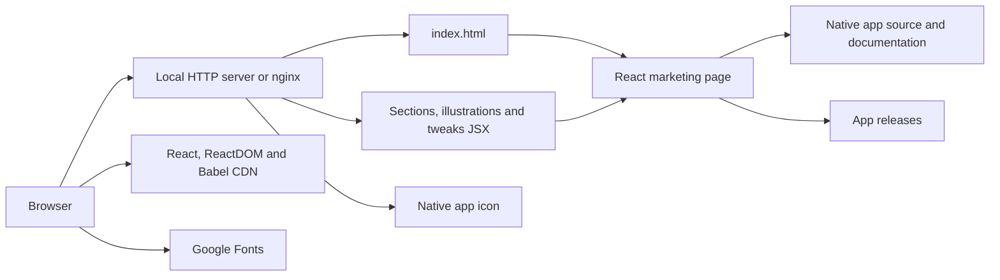

# PolyJuiceVoice landing page

The standalone marketing site for [PolyJuiceVoice](https://github.com/Team-AER/PolyJuiceVoice), Team AER's native on-device speech app for Apple silicon. It introduces preset speech, voice design, voice cloning with a manually entered reference transcript, and a saved voice library.

The current public product page is maintained in [Team-AER/aer-landing → polyjuicevoice](https://github.com/Team-AER/aer-landing/tree/main/polyjuicevoice). This repository retains the earlier standalone React/JSX site and its Docker/nginx delivery configuration. App source, build instructions, releases and privacy documentation belong to the [native app repository](https://github.com/Team-AER/PolyJuiceVoice).

## What the site includes

- Responsive navigation, a product hero, custom SVG illustrations and feature sections.
- An interactive studio **mockup** with voice selection, editable text and simulated progress/waveform; it does not load models or synthesize audio.
- Requirements and links to source, releases, build instructions and privacy details.
- A development tweaks panel for accent color and the background grid.
- The existing native app icon, with its MIT notice in [assets/LICENSE](assets/LICENSE).

The app requires macOS 26+ or iOS 26+ on a physical supported device and Xcode 26+ to build. It uses Qwen3-TTS through Swift/MLX, downloads selected Hugging Face model snapshots through Model Manager, and exports 24 kHz mono WAV. Synthesis is local; optional iCloud sync transfers saved voice metadata, reference recordings and embeddings. See [the app documentation](https://github.com/Team-AER/PolyJuiceVoice/tree/main/docs) for current requirements and capabilities.

## Delivery architecture



This website depends on externally hosted scripts and fonts; it is not an offline distribution of the native app.

## Preview locally

No npm install or frontend build is required. Serve the directory over HTTP; opening `index.html` as a file can block Babel's JSX requests.

```bash
python3 -m http.server 8080 --bind 127.0.0.1
```

Open [localhost:8080](http://localhost:8080). For the repository's nginx configuration:

```bash
docker compose config
docker compose up --build
```

Compose binds `127.0.0.1:8080` by default. Use `HOST_PORT=8081 docker compose up --build` if that port is occupied. HTML and JSX files are mounted read-only, so edits appear on refresh; rebuild the image after changes to copied assets or nginx configuration. Stop with `docker compose down`.

## Repository guide

| Path | Purpose |
| --- | --- |
| `index.html` | Page shell, styles, pinned CDN dependencies and React entry point |
| `sections.jsx` | Navigation, feature copy, studio mockup, specs and footer |
| `illustrations.jsx` | Original voice-themed SVG illustrations |
| `tweaks-panel.jsx` | Interactive design controls |
| `assets/` | Native app icon and preserved license notice |
| `nginx/default.conf` | Static serving, JSX MIME type and response headers |
| `Dockerfile`, `docker-compose.yml` | nginx image and loopback development service |
| `deploy/`, `.github/workflows/` | Existing standalone deployment configuration |

See [the maintenance guide](docs/MAINTENANCE.md) for copy, asset and verification guidance.

## Credits and license

Thanks to the [Qwen3-TTS](https://github.com/QwenLM/Qwen3-TTS) and [MLX Swift](https://github.com/ml-explore/mlx-swift) teams for the model and inference foundations of the native app. Those dependencies are not bundled by this landing page; their licenses remain separate. The site's original illustrations and copied app icon retain their existing attribution.

This repository is [MIT licensed](LICENSE), copyright © 2026 Prakhar Shukla. Existing notices are preserved.
